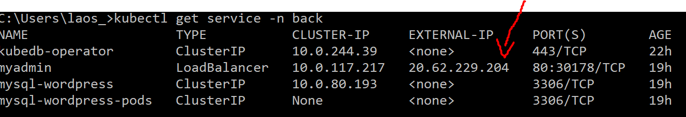
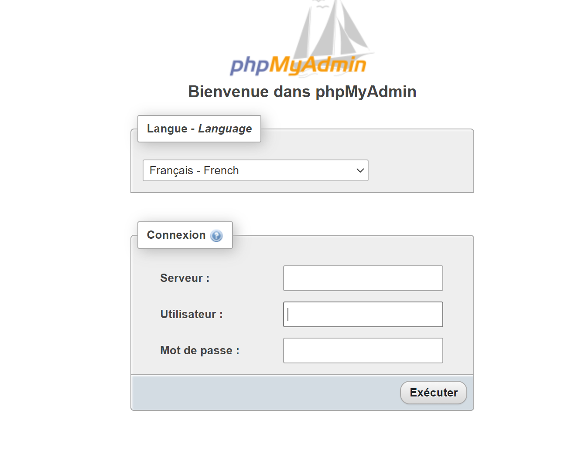
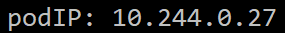
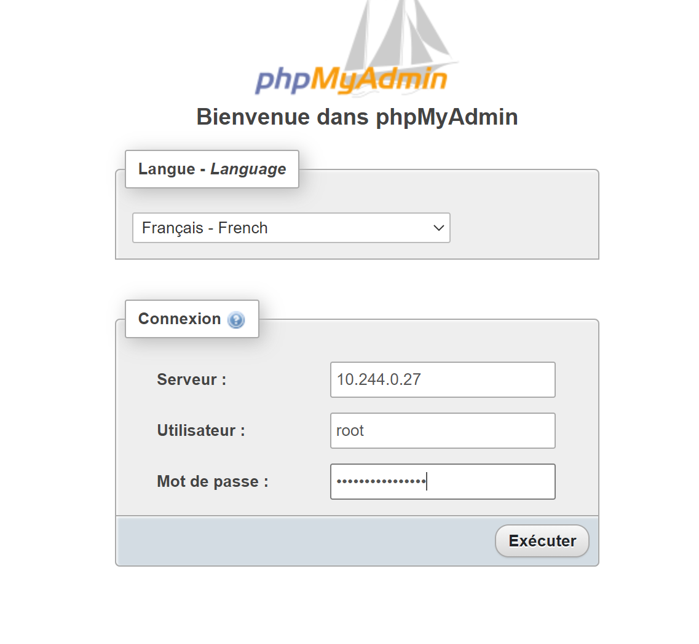
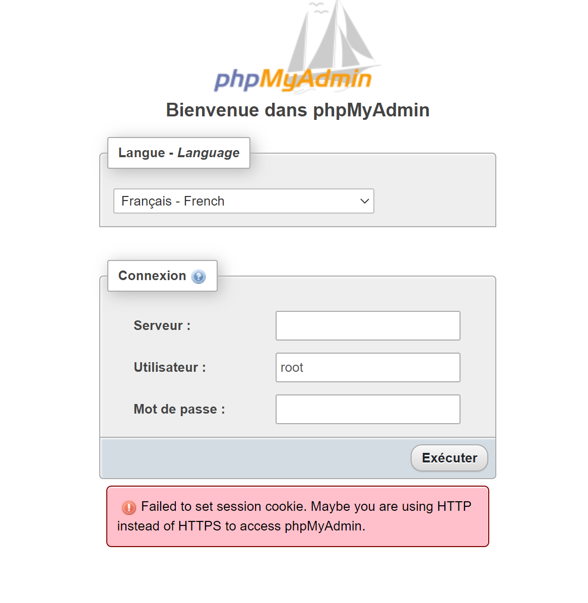

# TP Kubernetes

## 1. Découpage namespace

On a réalisé un découpage en 2 parties, le premier sera le front ceux qui va contenir tout ce qui est wordpress. Le second back, va contenir toute la bdd avec KubeDB. Et le dernier sera le monitoring qui va gérer grafana et prometheus.

## 2. KubeDB:

### Mise en place de MYSQL
Pour pouvoir installer KubeDB il faut tout d'abord installer Helm, pour ce faire:

On est passé par chocolatey en tapant cette commande:

    choco install kubernetes-helm

On peut ensuite installer KubeDB sur le cluster.

    helm repo add appscode https://charts.appscode.com/stable/
    helm repo update
    helm search appscode/kubedb

La première commande nous permet d'ajouter KubeDB au cluster, la seconde de mettre à jour les charts de helm, et la troisième de nous assurer que KubeDB est bien installé.

Maintenant que KubeDB est installé, il faut le mettre sur le namespace sur lequel on va vouloir créer notre BDD.

    helm install kubedb-operator appscode/kubedb --version 0.15.2 -n back
    helm install kubedb-catalog appscode/kubedb-catalog --version 0.15.2 -n back

La première commande éxécute l'install de kubedb operator pour le faire fonctionner sur le namespace back. Le second va pouvoir permettre de créer des pod avec pour image mysql.

Il va maintenant falloir créer un dockerfile avec un deployment et un service pour pouvoir utiliser un pod mysql, car cela va créer un phpmyadmin.

La commande a rentré est celle-ci:

    kubectl create -f monfichier.yml -n back 

Cela va créer un phpmyadmin en service on peut le voir en rentrant la commande suivant:

    kubectl get service -n back

On récupère l'external-ip :

Ce qui nous permettra d'accéder à la connexion de phpmyadmin.

Maintenant que tout ca est prêt on va pouvoir créer notre première BDD mysql sur notre phpmyadmin avec un dockerfile et en rentrant la commande suivante:

    kubectl create -f monfichier.yml -n back

En rentrant cette commande nous avons créé un pod mysql qui va nous permettre de nous connecter au phpmyadmin.

    kubectl get pods mysql-wordpress-0 -n back -o yaml | grep podIP

Cette commande nous permet de récupérer le serveur sur lequel nous voulons nous connecter.

    kubectl get secrets -n back mysql-wordpress-auth -o jsonpath='{.data.\username}'

La commande nous renvoie le nom d'utilisateur secret en base 64.

    kubectl get secrets -n back mysql-wordpress-auth -o jsonpath='{.data.\password}'

Pareil que la commande qu'au dessus mais celle-ci est le mot de passe.
Il faut donc ne pas oublier de mettre en base 10.

Pour terminer nous avons eu des problèmes pour la suite, defois nous pouvions nous connecter mais nous avons une erreur comme quoi la connexion au serveur s'arrêter dès l'instant ou nous nous connections.
Ou nous avions une erreur qui disait que nous étions pas en https donc impossible pour nous de se connecter.

Au final nous avons réussi à nous connecter. Mais toutefois il nous arrive d'avoir l'erreur.

### Principe de CRD

Un CRD nous permet de créer notre propre ressource sur kubernetes à la places des types: Pod, Service..

C'est grâce à cela qu'on peut créer des choses tels que le type MySQL.

## 3. WordPress

Nous avons installé wordpress avec la commande suivante:

    helm repo add bitnami https://charts.bitnami.com/bitnami -n front
    helm install my-release bitnami/wordpress -n front

Pour ensuite voir si cela est bien installé on peut taper la commande:

    kubectl get service -n front

On peut ainsi récupérer l'external-ip et se connecter dessus et on peut voir que cela fonctionne.

Nous avons ensuite rencontré des erreurs et n'avons pas pu continuer dessus.

## 4. RBAC
Les rôles ont été créés depuis Microsoft Azure dans Contrôle d’accès (IAM) -> Rôles  depuis le groupe de ressources ProjetKubernet.
Nous avons donc créé quatre rôles personnalisés: 
Administrateur de cluster : Permission de tout lire et de créer des cluser, pas le droit de suppression
Développeur : Permission de tout lire et écrire, pas le permission de toucher aux ressources
Sysops: Permission de write / read / delete
Client: Pas finalisé, problème de permissions

## 5. Monitoring
### Mise en place de Prometheus
Dans un premier temps nous avons installé Prometheus pour créer des graphiques avec nos données.

Installation de la charte stable :

    helm repo add stable https://charts.helm.sh/stable

Création d'un namespace monitoring :

    kubectl create ns monitoring

Mise en place de promotheus sur le namespace monitoring :

    helm install prometheus stable/prometheus-operator --namespace monitoring

Vérification de l'installation :

    kubectl --namespace monitoring get pods -l "release=prometheus"

Mise en place de prometheus sur un port-forward (port 9090):

    kubectl port-forward -n monitoring prometheus-prometheus-prometheus-oper-prometheus-0 9090

### Mise en place de Grafana

Grafana reprend les données de Prometheus et les affiches dans dans graphiques plus poussés avec la possibilité d'afficher des alertes.

Installation de grafana dans le namespace monitoring, le même que prometheus :

    helm install grafana --namespace monitoring stable/grafana

Mise en place de grafana sur un second port forward (port 3000) :

    kubectl port-forward -n monitoring prometheus-grafana-85b4dbb556-8v8dw 3000
    
Création des identifiants de grafana en base 64 :

    kubectl get secret -n monitoring grafana-credentials -o yaml

Pour obtenir les identifiants d'authentification, nous les avons passé de la base 64 à la base 10.
Une fois l'installation en place, nous avons ajouté une alerte à Grafana.

