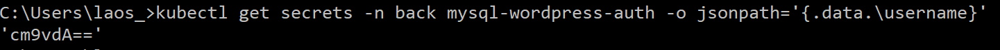
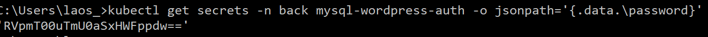
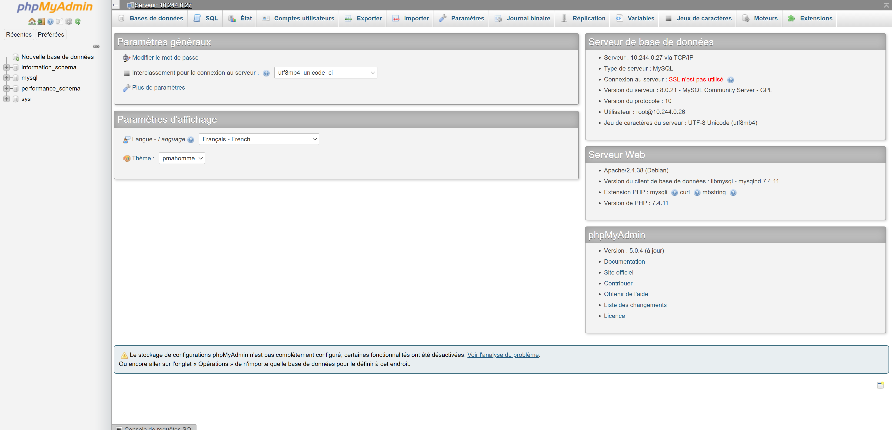

# TP Kubernetes

## 1. Découpage namespace

On a réalisé un découpage en 2 parties, le premier sera le front ceux qui va contenir tout ce qui est wordpress. Le second back, va contenir toute la bdd avec KubeDB. Et le dernier sera le monitoring qui va gérer grafana et prometheus.

## KubeDB:
Pour pouvoir installer KubeDB il faut tout d'abord installer Helm, pour ce faire:

On est passé par chocolatey en tapant cette commande:

    choco install kubernetes-helm

On peut ensuite installer KubeDB sur le cluster.

    helm repo add appscode https://charts.appscode.com/stable/
    helm repo update
    helm search appscode/kubedb

La première commande nous permet d'ajouter KubeDB au cluster, la seconde de mettre à jour les charts de helm, et la troisième de nous assurer que KubeDB est bien installé.

Maintenant que KubeDB est installé, il faut le mettre sur le namespace sur lequel on va vouloir créer notre BDD.

    helm install kubedb-operator appscode/kubedb --version 0.15.2 -n back
    helm install kubedb-catalog appscode/kubedb-catalog --version 0.15.2 -n back

La première commande éxécute l'install de kubedb operator pour le faire fonctionner sur le namespace back. Le second va pouvoir permettre de créer des pod avec pour image mysql.

Il va maintenant falloir créer un dockerfile avec un deployment et un service pour pouvoir utiliser un pod mysql, car cela va créer un phpmyadmin.

La commande a rentré est celle-ci:

    kubectl create -f monfichier.yml -n back 

Cela va créer un phpmyadmin en service on peut le voir en rentrant la commande suivant:

    kubectl get service -n back

On récupère l'external-ip :

Ce qui nous permettra d'accéder à la connexion de phpmyadmin.

Maintenant que tout ca est prêt on va pouvoir créer notre première BDD mysql sur notre phpmyadmin avec un dockerfile et en rentrant la commande suivante:

    kubectl create -f monfichier.yml -n back

En rentrant cette commande nous avons créé un pod mysql qui va nous permettre de nous connecter au phpmyadmin.

    kubectl get pods mysql-wordpress-0 -n back -o yaml | grep podIP

Cette commande nous permet de récupérer le serveur sur lequel nous voulons nous connecter.

    kubectl get secrets -n back mysql-wordpress-auth -o jsonpath='{.data.\username}'

La commande nous renvoie le nom d'utilisateur secret en base 64.

    kubectl get secrets -n back mysql-wordpress-auth -o jsonpath='{.data.\password}'

Pareil que la commande qu'au dessus mais celle-ci est le mot de passe.
Il faut donc ne pas oublier de mettre en base 10.

Pour terminer nous avons eu des problèmes pour la suite, defois nous pouvions nous connecter mais nous avons une erreur comme quoi la connexion au serveur s'arrêter dès l'instant ou nous nous connections.
Ou nous avions une erreur qui disait que nous étions pas en https donc impossible pour nous de se connecter.

Au final nous avons réussi à nous connecter.

